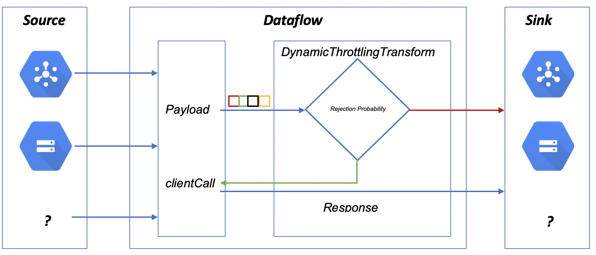

# Client-side Throttling in Dataflow

### Introduction

This artifact is designed to implement adaptive client-side throttling. Adaptive throttling activates when a service called by Dataflow starts rejecting requests due to throughput higher than expected. Adaptive throttling tracks the request rejection probability to decide whether it should fail locally without going through network to save the cost of rejecting a request.

### HTTP Server with Throttling capabilities

To simulate a third-party service a web server is created intended to accept and process certain number of HTTP requests only, remaining requests should get rejected. The requests will be sent from a job running on Dataflow. Each HTTP request will carry an element from the ParDo function as payload. See Appendix for more details.

### Dataflow Throttling

This is a generic library intended to implement client-side throttling by rejecting requests that have a high probability of being rejected locally on Dataflow nodes. Irrespective of Batch or Streaming, when Dataflow pipeline is sending HTTP requests to the server with input elements as payload, once the request has been processed by the backend, it should send a response back to the pipeline whether the http request has been accepted or rejected. The error code depends up on the backend throttling implementation (defaults to HTTP code 429).



### Throttle with multiple groups

Implemented DynamicThrottlingTransform using stateful processing with single group of elements that represent requests to the external service. We’re going to maintain the following states.

* incomingRequests - requests stored in Apache Beam bag state
* acceptedRequests number
* totalRequestsProcessed number

The count of the incoming requests and accepted requests should be equal under normal conditions. Once the requests start getting rejected, the number of processing requests gets decreased by the difference of incoming requests and accepted requests.

Pipeline will process the payload in multiple number of groups as well. To achieve this, pipeline will transforms the single PCollection[Bounded/Unbounded] into multiple groups.

* Converts the Input PCollection<<T>T</T>> into PCollection<<T>Key,Value</T>>. Here, Key will be randomly assigned integer and Value will be payload.
* All the elements with the same key will be grouped together and emit another PCollection<<T>Key,Iterable</T>>>, where key will be unique and Iterable<<T>T</T>> will be the collection of elements with the same key.
* Adaptive throttling will be applied to each group[State cell] accordingly.
* Pipeline will process the each state cell using timely processing. That said each state cell will be processed after reaching a predefined interval of  time. A user function will be applied on a group of elements.
* clientCall is a user defined function where the events will be sent to the backend node, Applies to each event in the pipeline. Based on the response of the clientCall respective counters will get incremented.
* The variables which stores the number of requested and accepted requests are zeroed out after a certain interval of time (defaults to 1 min). This reset speeds up client recovery if server throughput was limited due to limitations on the server side not caused by the client.

### Adaptive throttling

Dataflow pipeline will maintain the number of requests it has sent to the backend [total_requests], the number of requests got accepted by the backend [total_accepts]. Using stateTimer, It will process a batch of elements from each state value and removes the processed elements from the state value. Request rejection probability will be calculated as follows.
    ```RequestRejectionProbability = (total_requests - k * total_accepts)/(total_requests+1)```
If it is more than a random number between 0 or 1, incoming requests will be sent to either Pub/Sub dead letter queue or any other sink defined by the user.

### Library testing

#### Requirements

* Install Java 8
* Install Maven 3

#### Clone the repository

* git clone https://github.com/GoogleCloudPlatform/professional-services.git to GCE instance/Localmachine.
* Change directory to professional-services/examples/dataflowthrottling/src/main/java/com/google/cloud/pso/dataflowthrottling
* Change the InetSocketAddress in HttpServerThrottling.java to your Compute Engine instance internal IP or with ‘localhost’ if you’re using DirectRunner to run DataFlow on your local machine.

#### Compile and run the backend server

```bash
javac HttpServerThrottling.java && java HttpServerThrottling
```

#### How to run DynamicThrottlingTransform?

* Create a Google Cloud Platform project.
* Goto GCP console and activate cloud shell.
		 Change the directory to $HOME
* Alternatively to run  on your machine set up a service account.
		In GCP console, In navigation menu goto IAM & Admin and click on service accounts.
		Create a service account and for role select Dataflow worker.
		Create a key and download to your machine.
		Export it to environment variable GOOGLE_APPLICATION_CREDENTIALS.
* Create a cloud storage bucket where input and output objects can be stored.
* Install JDK and Apache Maven on your machine as well.
* Clone the repository.
```bash
#Project vars
PROJECT_ID=<project-id>
BUCKET=<bucket>
PIPELINE_FOLDER=gs://${BUCKET}/dataflowthrottling
#Set the runner
RUNNER=DataflowRunner
#Build the template
mvn clean
mvn compile exec:java \
-Dexec.mainClass=com.google.cloud.pso.dataflowthrottling.ThrottlingOrchestration \
-Dexec.args=” \
--project = ${PROJECT_ID} \
--stagingLoaction = ${PIPELINE_FOLDER}/staging \
--tempLoaction = ${PIPELINE_FOLDER}/temp \
--inputFilePattern = ${PIPELINE_FOLDER}/input \
--outputFilePattern = ${PIPELINE_FOLDER}/output/ \
--inputTopic = projects/${PROJECT_ID}/topics/${TOPIC_NAME} \
--runner = ${RUNNER}”
```
* Expected results
	Successful requests will write return value from clientCall to `${PIPELINE_FOLDER}/output/successTag`.
	Throttled requests and rejected by backend node are going to write payload and out of quota error as follows to `${PIPELINE_FOLDER}/output/throttlingTag`.
		Throttled request will write `{"input": payload,"error":"Throttled by Client. Request rejection probability: 0.3111111111111111"}`.
		Rejected by backend will write `{"input":"payload","error":"Server returned HTTP response code: 429"}`.
	Requests which are failed with unexpected errors will write back payload and corresponding error as follows to `${PIPELINE_FOLDER}/output/errorTag`.
		`{"input":"payload","error":"Corresponding error"}`.
* If you want to call a dependency other than Java Http Server, update lambda function `clientCall` with how each request should be processed.
```
DynamicThrottlingTransform<InputType, OutputType> clientCall = request -> {
//Process the request
response = request_response.
if(response is Out of Quota Error)
throw new ThrottlingException;
else
return request_response;
}
```